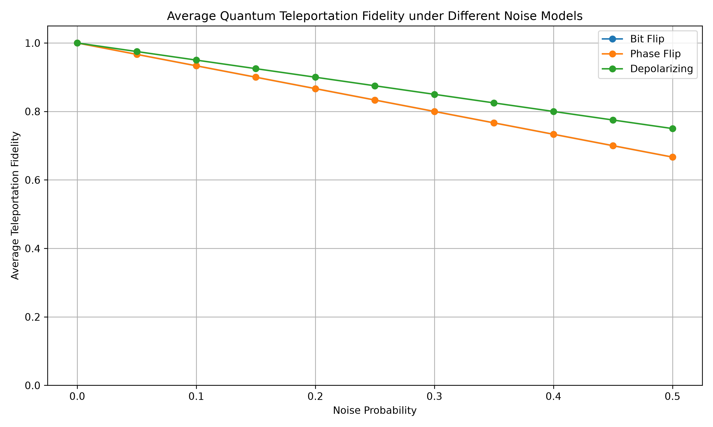
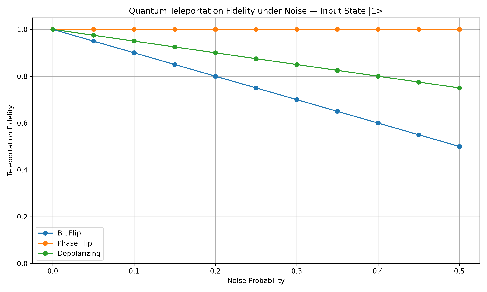
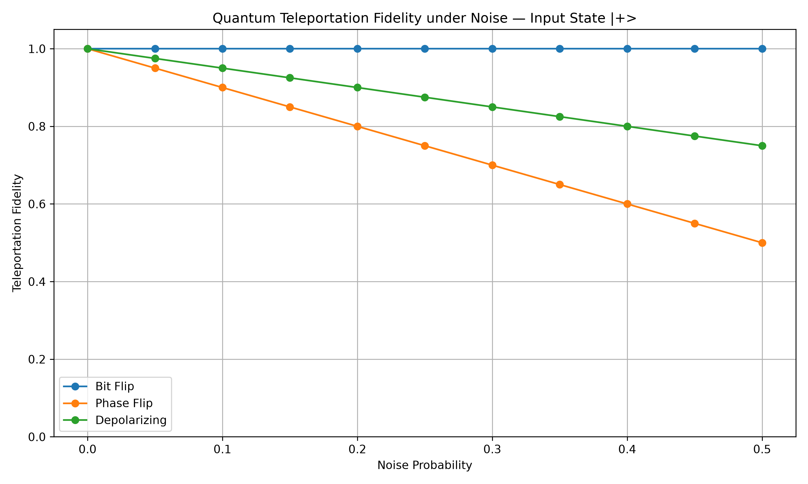
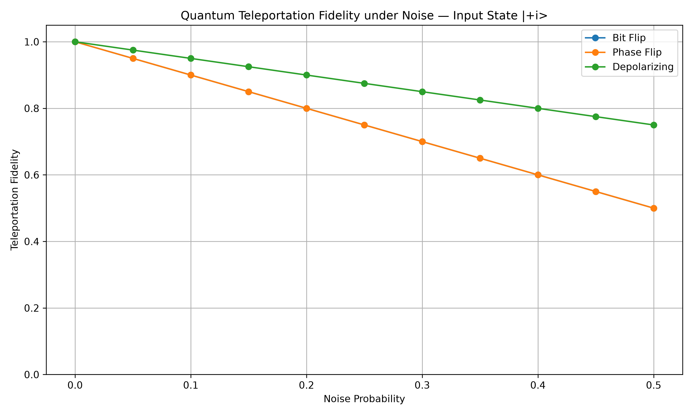

# Simulation and Performance Analysis of Quantum Teleportation under Noisy Conditions

## Overview

**Quantum teleportation** is a fundamental quantum communication protocol that transfers the quantum state of one qubit from a sender (Alice) to a receiver (Bob) using **entanglement** and **classical communication**.

On an ideal quantum computer, teleportation transfers an unknown quantum state with perfect fidelity. Real quantum systems, however, are affected by noise and decoherence, which reduce the quality of the transmitted state.

This project implements the complete quantum teleportation protocol using **Qiskit** and studies how different noise models affect its performance. Teleportation is evaluated under:

- **Bit-flip** noise
- **Phase-flip** noise
- **Depolarizing** noise

The effect of noise is measured using **quantum state fidelity** for multiple input states and different noise probabilities.

## Research Question

> How robust is quantum teleportation when the quantum channel is affected by different types and levels of noise?

## Objectives

- Implement the quantum teleportation protocol using Qiskit.
- Verify teleportation under ideal, noise-free conditions.
- Introduce different quantum noise models into the teleportation channel.
- Test teleportation using multiple representative input states.
- Measure the quality of the teleported state using quantum state fidelity.
- Analyze how fidelity changes as the noise probability increases.
- Compare the effect of different noise models.
- Visualize the experimental results using plots.

## How Quantum Teleportation Works

Quantum teleportation transfers the state of an input qubit from Alice to Bob without directly transmitting the original qubit.

The protocol uses three qubits:

| Qubit | Role |
|-------|------|
| Qubit 0 | Alice's input state |
| Qubit 1 | Alice's half of the entangled Bell pair |
| Qubit 2 | Bob's half of the entangled Bell pair |

The teleportation process consists of the following stages:

1. Prepare the input quantum state.
2. Create an entangled Bell pair between Alice and Bob.
3. Apply noise to Bob's qubit to simulate an imperfect quantum channel.
4. Perform Alice's Bell-state measurement.
5. Send the two classical measurement results to Bob.
6. Bob applies conditional X and Z corrections.
7. Extract Bob's final quantum state.
8. Calculate the fidelity between the original and teleported states.

## Input States

The experiment evaluates six single-qubit input states, covering the computational, X, and Y bases.

| State | Basis |
|-------|-------|
| `\|0⟩` | Computational (Z) |
| `\|1⟩` | Computational (Z) |
| `\|+⟩` | X |
| `\|-⟩` | X |
| `\|+i⟩` | Y |
| `\|-i⟩` | Y |

## Noise Models

Three noise models are introduced into the teleportation channel.

### Bit-Flip Noise

Applies the Pauli-X operation with probability `p`.

```
|0⟩ → |1⟩
|1⟩ → |0⟩
```

### Phase-Flip Noise

Applies the Pauli-Z operation with probability `p`. It changes the relative phase of the state, for example:

```
|+⟩ → |-⟩
```

The effect of phase-flip noise depends strongly on the basis of the input state.

### Depolarizing Noise

A more general form of noise in which the qubit can experience different Pauli errors. The experiment uses Qiskit's `depolarizing_error()` model.

## Experimental Methodology

The noise probability is varied from 0.00 to 0.50 in increments of 0.05:

```
0.00, 0.05, 0.10, 0.15, 0.20,
0.25, 0.30, 0.35, 0.40, 0.45, 0.50
```

The teleportation circuit is simulated for every combination of:

- 6 input states
- 3 noise models
- 11 noise probabilities

An ideal, noise-free baseline is also calculated for each input state:

```
6 × 3 × 11 = 198 noisy experimental cases
6 ideal baseline cases
-----------------------------------------
204 simulation cases in total
```

## Evaluation Metric

### Quantum State Fidelity

Performance is measured using **quantum state fidelity**. For a pure input state |ψ⟩ and Bob's final density matrix ρ:

```
F = ⟨ψ|ρ|ψ⟩
```

- **F = 1** means the teleported state is identical to the target state.
- A lower fidelity means the teleported state has been degraded by noise.
- **Higher fidelity means better teleportation performance.**

## Simulation Setup

The project uses Qiskit's **density-matrix simulator** to obtain Bob's final quantum state. The main simulation flow is:

```
Input State
     ↓
Prepare Alice's Qubit
     ↓
Create Bell Pair
     ↓
Apply Channel Noise
     ↓
Bell-State Measurement
     ↓
Classical Communication
     ↓
Bob's Conditional Corrections
     ↓
Bob's Final Density Matrix
     ↓
Quantum State Fidelity
```

## Results

### Ideal Teleportation

Under ideal, noise-free conditions, all tested input states achieve approximately **F = 1.0**. This verifies that the implemented protocol correctly transfers the tested quantum states.

### Average Fidelity

The plot below shows how the average teleportation fidelity (across all six input states) changes as the noise probability increases.



### Fidelity for Individual Input States

#### `|0⟩` State


#### `|1⟩` State



#### `|+⟩` State



#### `|-⟩` State


#### `|+i⟩` State



#### `|-i⟩` State


### Results at Noise Probability 0.50

Fidelity values at the highest tested noise probability, `p = 0.50`:

| Input State | Bit Flip | Phase Flip | Depolarizing |
|-------------|:--------:|:----------:|:------------:|
| `\|0⟩`  | 0.50 | 1.00 | 0.75 |
| `\|1⟩`  | 0.50 | 1.00 | 0.75 |
| `\|+⟩`  | 1.00 | 0.50 | 0.75 |
| `\|-⟩`  | 1.00 | 0.50 | 0.75 |
| `\|+i⟩` | 0.50 | 0.50 | 0.75 |
| `\|-i⟩` | 0.50 | 0.50 | 0.75 |

## Key Findings

1. **Ideal teleportation achieves perfect fidelity.** Without noise, all tested states reach a fidelity of approximately 1.0, confirming the circuit works correctly.

2. **Increasing noise generally reduces fidelity.** As the noise probability rises, the fidelity of the teleported state generally decreases, showing the sensitivity of teleportation to channel errors.

3. **Bit-flip noise depends on the input basis.** It strongly affects computational-basis states `|0⟩` and `|1⟩`. The X-basis states `|+⟩` and `|-⟩` are eigenstates of the X operation and remain unaffected.

4. **Phase-flip noise depends on the input basis.** It strongly affects `|+⟩` and `|-⟩`. The computational-basis states `|0⟩` and `|1⟩` are unchanged apart from a physically irrelevant global phase.

5. **Y-basis states are affected by both bit and phase flips.** `|+i⟩` and `|-i⟩` are sensitive to both X and Z errors, so both noise types reduce their fidelity.

6. **Depolarizing noise affects all tested states.** Unlike the basis-dependent behavior of bit-flip and phase-flip noise, depolarizing noise degrades every tested state. Under the Qiskit parameterization used here, the six-state average fidelity stays higher than the bit-flip and phase-flip averages at high noise probabilities.

At `p = 0.50`, the approximate six-state averages are:

| Noise Model | Average Fidelity |
|-------------|:----------------:|
| Bit Flip | 0.667 |
| Phase Flip | 0.667 |
| Depolarizing | 0.750 |

These values describe the specific noise models and parameterization used in this simulation.

## Project Structure

```
quantum-teleportation-noise-analysis/
│
├── src/
│   ├── teleportation.py
│   ├── noise_models.py
│   ├── experiments.py
│   └── analysis.py
│
├── experiments/
│
├── results/
│   ├── data/
│   │   └── teleportation_fidelity_results.csv
│   │
│   └── plots/
│       ├── average_fidelity.png
│       ├── fidelity_0.png
│       ├── fidelity_1.png
│       ├── fidelity_plus.png
│       ├── fidelity_minus.png
│       ├── fidelity_plusi.png
│       └── fidelity_minusi.png
│
├── notebooks/
│
├── README.md
├── requirements.txt
└── .gitignore
```

## Installation

### 1. Clone the Repository

```bash
git clone https://github.com/ChaitanyaGorrepati/quantum-teleportation-noise-analysis.git
cd quantum-teleportation-noise-analysis
```

### 2. Create the Python Environment

A separate environment is recommended. With Conda:

```bash
conda create -n quantum-teleportation python=3.11
conda activate quantum-teleportation
```

### 3. Install Dependencies

```bash
pip install -r requirements.txt
```

## Running the Project

### Step 1: Run the Experiments

From the project root directory:

```bash
python src/experiments.py
```

This runs the teleportation experiments for all input states, noise models, and noise probabilities. The data is saved to `results/data/teleportation_fidelity_results.csv`.

### Step 2: Generate the Plots

```bash
python src/analysis.py
```

The plots are saved to `results/plots/`.

## Technologies Used

| Technology | Purpose |
|------------|---------|
| **Python** | Programming language |
| **Qiskit** | Quantum circuit construction |
| **Qiskit Aer** | Quantum circuit simulation |
| **NumPy** | Numerical computation |
| **Pandas** | Experimental data processing |
| **Matplotlib** | Data visualization |
| **Git & GitHub** | Version control and project management |

## Limitations

- This is a simulation-based study and does not run teleportation on a physical quantum processor.
- Only a limited set of noise models and six representative input states are used.
- The noise probability has model-specific semantics in Qiskit, so the numerical values should be interpreted within this simulation setup rather than as a universal physical comparison of real quantum hardware.

## Future Work

- Add amplitude-damping noise.
- Add thermal relaxation noise.
- Study correlated noise.
- Test a larger set of arbitrary single-qubit states.
- Compare different quantum simulators.
- Run the teleportation circuit on real quantum hardware.
- Investigate the effect of measurement errors.
- Study the effect of noise on larger quantum communication protocols.
- Compare simulation results with experimental hardware results.

## Conclusion

This project implements and analyzes quantum teleportation under noisy conditions. The ideal circuit transfers all tested input states with near-perfect fidelity. When noise is introduced into the channel, fidelity depends on both the type of noise and the input state.

The experiments show that:

- Teleportation works reliably under ideal conditions.
- Noise probability has a significant effect on fidelity.
- Bit-flip and phase-flip errors exhibit strong basis-dependent behavior.
- Y-basis states are affected by both bit-flip and phase-flip noise.
- Depolarizing noise affects all tested states.
- Different noise models produce different fidelity trends.

Overall, the project provides a practical, simulation-based study of the robustness of quantum teleportation and shows how quantum noise can be analyzed quantitatively using fidelity.

## Author

**Chaitanya Gorrepati**
Engineering Student, IIIT Sri City